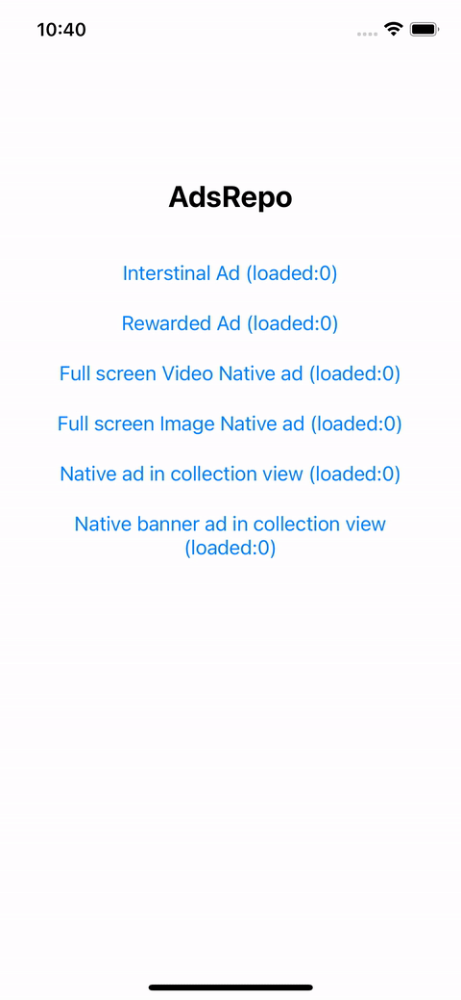
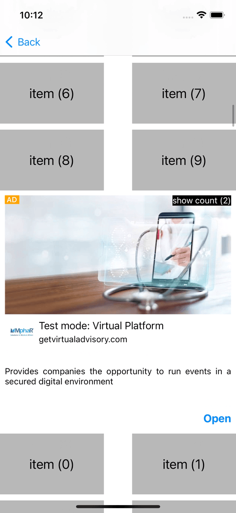
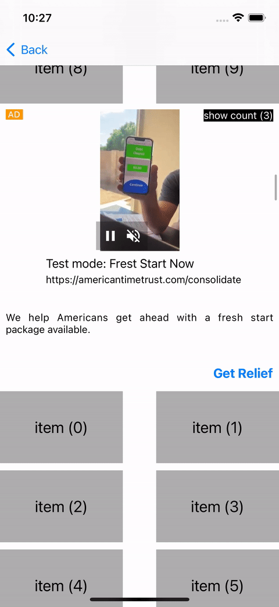
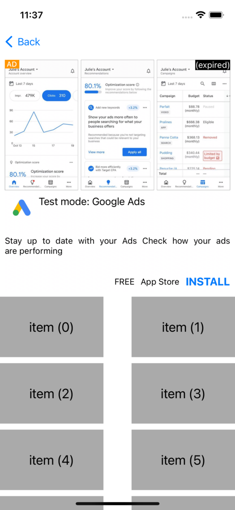

# AdsRepo

[](https://choosealicense.com/licenses/mit/) [](https://travis-ci.org/x-oauth-basic/AdsRepo) [](https://cocoapods.org/pods/AdsRepo)
[](https://github.com/Carthage/Carthage)
[](https://img.shields.io/badge/Swift_Package_Manager-compatible-orange?style=flat-square)

**AdsRepo** is a Swift base library for managing and loading different ad units simultaneously and controlling all of them under repository options and functions. the repository will load ads and keep them fresh base on developer-specific conditions and you only communicate with the repository to get ads.

## Screenshots

| **Fast load**                                               | **multipale repositories**                                   |
| ----------------------------------------------------------- | ------------------------------------------------------------ |
|    |    |
| **Auto refresh**                                            | **Notify expire ads**                                        |
|  |  |

- [Features](#features)
- [Requirements](#requirements)
- [Installation](#installation)
  - [CocoPods](#cocopods)
  - [Carthage](#carthage)
  - [Swift Package Manager](#swift-package-manager)
- [Usage/Examples](#usage/examples)
  -  [Create Repository](#create-repository)
  - [Use your Repositories](#use-your-repositories)
  - [Other repository options](#other-repository-options)
  - [Ad Loader](#ad-Loader)
  - [Ad Wrapper](#ad-Wrapper)
  - [Error handler](#error-handler)
  - [Network reachability](#network-reachability)
- [Run tests](#run-tests)
- [FAQ](#faq)
- [Authors](#authors)
- [Contributing](#contributing)
- [License](#license)

## Features

- Easy to use.
- Load ads as fast as possible.
- Manage ads reload time.
- Manage the show number for each ad.
- Automatically will expire ads under the condition specified by the developer.
- Try to handle errors in an efficient way.
- All functions have Quick Help.

## Requirements

- iOS 12+
- Swift 5.0+ 

## Installation

### CocoPods

AdsRepo is available through [CocoaPods](https://cocoapods.org). To install
it, simply add the following line to your Podfile:

```ruby
# core only
pod 'AdsRepo'

# core + GoogleMobileAds
pod 'AdsRepo/GoogleMobileAds'

# with core tests
pod 'AdsRepo' , :testspecs => ['Tests']

# with core tests + GoogleMobileAds testes
pod 'AdsRepo/GoogleMobileAds' , :testspecs => ['Tests']
```

### Carthage

[Carthage](https://github.com/Carthage/Carthage) is a decentralized dependency manager that builds your dependencies and provides you with binary frameworks. To integrate **AdsRepo** into your Xcode project using Carthage, specify it in your `Cartfile`:

```ogdl
github "SwiftLand/AdsRepo"
```

### Swift Package Manager

The [Swift Package Manager](https://swift.org/package-manager/) is a tool for automating the distribution of Swift code and is integrated into the `swift` compiler. 
Once you have your Swift package set up, adding **AdsRepo** as a dependency is as easy as adding it to the `dependencies` value of your `Package.swift`.

```swift
dependencies: [
    .package(url: "https://github.com/ali72/AdsRepo.git", .upToNextMajor(from: "Latest_version"))
]
```

### Manually

Alternatively you can copy the `Sources` folder and its files into your project and install the required dependencies.

- [AdMob](https://developers.google.com/admob/ios/quick-start#manual_download)

## Usage/Examples

### Create Repository

We have three pre-made repositories.**Native**,**Interstitial** and **Rewarded** all repositories at least require **RepositoryConfig** value to initialize.

**AdRepositoryConfig** is a struct that contains all non-mutable repository properties.

```swift
public struct AdRepositoryConfig{
    public let adUnitId:String
    public let size:Int
    public var expireIntervalTime:TimeInterval//in second
    public var showCountThreshold:Int

    /// Init non-mutable `RepositoryConfig` struct
    /// - Parameters:
    ///   - adUnitId: Unit Id that's google provided
    ///   - size: Repository total size
    ///   - expireIntervalTime: Expire time  in seconds for each repository ad
    ///   - showCountThreshold: Max number that the repository can load each ad
    init(adUnitId: String, size: Int, expireIntervalTime: TimeInterval = 120, showCountThreshold: Int = 1) {
        self.adUnitId = adUnitId
        self.size = size
        self.expireIntervalTime = expireIntervalTime
        self.showCountThreshold = showCountThreshold
    }
}
```

After you create your configuration pass it to your repository instance.

```swift
// for InterstitialAds
let interstitialAdRepo = InterstitialAdRepository(config:/*Your RepositoryConfig*/)
// for Rewarded Ads
let rewardedAdRepo = RewardedAdRepository(config:/*Your RepositoryConfig*/)
// for Native Ads
let nativeAdRepo = NativeAdRepository(config:/*Your RepositoryConfig*/)
```

Or you can create your own repository instance.

```swift
// for InterstitialAds
AdRepository</*Your AdWrapperType*/,/*Your AdLoadertype*/>(config:/*your RepositoryConfig*/)
```

**NOTE:** If you install the library with the `GoogleMobileAds` option, you can use pre-made repositories. they are actually a type alias for the `AdRepository` object.

```swift
public typealias InterstitalAdRepository = AdRepository<GADInterstitialAdWrapper,InterstitialAdLoader>
public typealias RewardedAdRepository = AdRepository<GADRewardedAdWrapper,RewardedAdLoader>
public typealias NativeAdRepository = AdRepository<GADNativeAdWrapper,NativeAdLoader>
```

**NOTE:** It's better to keep your repository as a singleton instance. see the example project for more details.

### Use your Repositories

You can call `loadAd` to get an ad under conditions specified by the developer. for example for an interstitial ad, we act like the following code:

```swift
 //ask repository to give you an ad (ex: interstitial ad reposityory)
 guard let adWrapper =  interstitialAdRepo.loadAd() else {return}

 //get interstitial ad from loadedAd property
 adWrapper.loadedAd.present(fromRootViewController: self)
```

If the ad loader returns `nil` that means the repository doesn't have and valid ad yet and you have an observer repository until ads load. for the `UIViewcontroller`, you can add an observer in `viewWillAppear` and remove it in `viewWillDisappear`.

```swift
 override func viewWillAppear(_ animated: Bool) {
        interstitialAdRepo.add(Observer: self)   
 }

  override func viewWillDisappear(_ animated: Bool) {
       interstitialAdRepo.remove(Observer: self)
  }
```

In this way, you have to implement `AdRepositoryDelegate` :

```swift
public protocol AdRepositoryDelegate:NSObject{
    ///Will call after each ad receives.
    /// - Parameter repo: current native Ad repository
    func adRepository(didReceive repository:AnyRepositoryType)

    ///Will call when the repository finished load ads whether the process success or failed.
    /// - Parameters:
    ///   - repo:  Repository which finished the load ads process.
    ///   - error: Final error after retries base on error handler object. see **ErrorHandler.swift** for more details.
    func adRepository(didFinishLoading repository:AnyRepositoryType,error:Error?)

    /// Will call when a repository's ad expired. see  **AdRepositoryConfig.swift** for more detail
    /// - Parameters:
    ///   - ad: The expired ad
    ///   - repository: Repository which contains the expired ad
    func adRepository(didExpire ad:AnyAdType,in repository:AnyRepositoryType)

    /// Will call when a repository's ad is removed from the repository under `invalidAdcondition`. see  **AdRepository.swift** for more detail
    /// - Parameters:
    ///   - ad: The removed ad
    ///   - repository: Repository which contains the removed ad
    func adRepository(didRemove ad:AnyAdType,in repository:AnyRepositoryType)
} 
```

After `didReceive` or `didFinishLoading` was called (based on your need) you can ask the repository to give you an ad by calling `loadAd` function.

**NOTE:** Please see the example project to find the best configuration for the ad repository and also know how to use `GAdNativeAd` in `UICollectionView` and `UITableView` in the best way.

### Other repository options

Here we listed public property and function in the repository object you can also use this protocol to implement your own ad repository class.

```swift
public protocol AdRepositoryProtocol:NSObject {

    associatedtype AdWrapperType

    associatedtype AdLoaderType

    //An object responsible to load ads from the ad provider
    var adLoader:AdLoaderType{get}

    /// Current repository configuration. See **AdRepositoryConfig.swift** for more details.
    var config:AdRepositoryConfig {get}

    /// Return `true` if current repository is in loading state
    var isLoading:Bool {get}

    /// If `true` repository will load new ads automatically when
    /// requiring otherwise you need to call `fillRepoAds` manually.
    var autoFill:Bool {set get}

    /// If `true` repository validates ads before loading them (defualt: `false`)
    var loadOnlyValidAd:Bool {set get}

    /// If `true` repository keep invalidate ads until new ad arrive them (defualt: `true`)
    /// - NOTE: You can use an ad multiple times before new ads arrive
    var waitForNewAdBeforeRemove:Bool {set get}

    /// If `true` repository remove all ads
    /// (also delegate `removeFromRepository` function for eachremoved ad) and never fill repository again even after call `fillRepoAds`,`loadAd` or `presentAd` function.
    /// If `false` and `autofill` is `true`  (default : `true`), It will fill repository with ads
    var isDisable:Bool{set get}

    /// Return `true` if the repository contains ads otherwise return `false`
    var hasAd:Bool{get}

    /// Return  repository valid total ad count
    var totalAdCount:Int{get}

    /// Return `true` if the repository contains valid ads otherwise return `false`
    var hasValidAd:Bool{get}

    /// Return  repository valid ad count
    var validAdCount:Int{get}

    /// Return `true` if the repository contains Invalid ads otherwise return `false`
    var hasInvalidAd:Bool{get}

    /// Return  repository invalid ad count
    var invalidAdCount:Int{get}

    ///An object responsible to handle error
    var errorHandler:AdRepositoryErrorHandlerProtocol {get set}

    ///An object responsible to handle network connectivity
    var reachability:AdRepositoryReachabilityPorotocol {get set}

    /// Condition used to validate ads. if return `true` ad is invalid otherwise is valid
    ///  - NOTE:by default use `showCount` and `expireIntervalTime` to validate ads in repository
    var invalidAdCondition:((AdWrapperType) -> Bool){get set}

    ///  Fill repository with new ads
    ///
    ///- Precondition
    ///    * Repository not disable
    ///    * Repository not fill with valid ads
    ///    * Repository contain invalid ads
    ///    * Repository not already in loading
    ///
    /// - Returns: true if start to fill repository otherwise return false
    @discardableResult
    func fillRepoAds()->Bool

    ///If the repository has at least one ad (in a developer-specified condition), will return that ad otherwise returns `nil`
    func loadAd()->AdWrapperType?

    /// Will remove invalid ads (which confirm `invalidAdCondition`) instantly
    /// - NOTE: After delete from repository, each ads will delegate `removeFromRepository` function
    func validateRepositoryAds()


    ///  Remove input ad and  fill repository with new ads if `autoFill` is `true`
    /// - Parameter ad:an ad object which will remove from the repository
    func invalidate(ad:AdWrapperType)

    /// Append delegate to the repository. the repository will call the delegate object when needed
    /// - Parameter delegate:an object which confirms the **AdRepositoryDelegate ** protocol
    func append(delegate:AdRepositoryDelegate)

    /// Remove a delegate from the repository.
    /// - Parameter delegate:an object which confirms the **AdRepositoryDelegate ** protocol
    func remove(delegate:AdRepositoryDelegate)
}
```

### Ad Loader

Each repository needs an ad loader to know how to load ads. to create a repository you have to set an ad loader and ad wrapper type as input generic type and the repository will init them when required.

You can create your custom ad loader by following this protocol:

```swift
public protocol AdLoaderProtocol:NSObject {

    associatedtype AdWrapperType = AdWrapperProtocol

    /// Return current state of this ad loader
    var state:AdLoaderState{get}

    /// Repository configuration. See **AdRepositoryConfig.swift** for more details.
    var config:AdRepositoryConfig{get}


    /// When this ad loader receives an ad, have to call this method. the default ad repository class will notify the new ads received by setting this closure.
    var notifyRepositoryDidReceiveAd:((_ ad:AdWrapperType)->())? { get set }

    /// When this ad loader finished loading the ad, have to call this method. the default ad repository class will notify all loading and process finished by setting this closure.
    var notifyRepositoryDidFinishLoad:((_ withError:Error?)->())? { get set }

    init(config:AdRepositoryConfig)

    /// The default ad repository class will call this function when need to become filled. See **AdRepository.swift** for more details.
    /// - Parameter count: number of require ads
    func load(count:Int)

}
```

**Note:** Default Ad loaders also have some other public properties and functions base on its type to controll and set load setting options.  

**Note:** If you install **AdsRepo** with the `GoogleMobileAds` option, we added some Ad loaders for you that you can use for creating your google type Ad Repository instance.

```swift
//To download and create Interstitial ads
InterstitialAdLoader

//To Download and create native ads
NativeAdLoader  

//To Download and create rewarded ads
RewardedAdLoader
```

### Ad Wrapper

We have to wrap each ad object with our `AdWrapper` object to add some extra properties to them. those properties will be used and controlled by their own ad repository instance.

But you are able to create your custom ad wrapper by following this protocol:

```swift
public protocol AdWrapperProtocol:NSObject{

    associatedtype AdType:NSObject

    /// Repository configuration. See **AdRepositoryConfig.swift** for more details.
    var config:AdRepositoryConfig{get}

    /// Unique id for the ad wrapper that used for some process in the ad's own repository
    var uniqueId:String{get}

    /// Any ad type object (ex: GADNativeAd)
    var loadedAd:AdType{get}

    /// Ad's  loaded Date
    var loadedDate:Date{get}

    /// Show how many time this object return as valid ads to user. See **loadAd** function in **AdRepository.swift** for more details
    /// - NOTE: This value typically changes by the ad's own repository but you can also change it if failed to show/present returned ad.
    var showCount:Int{get set}
}
```

**Note:** If you install **AdsRepo** with the `GoogleMobileAds` option, you will find out that we added some Google ads wrappers and you can simply use them:

```swift
// for InterstitialAds
GADInterstitialAdWrapper
// for Rewarded Ads
GADRewardedAdWrapper
// for Native Ads
GADNativeAdWrapper
```

### Error handler

**Error handler** is an object set to the repository and the repository uses it to get its own policy for each retry to load ads.

In default Error handler delay between each retry is set to 5 seconds and the max retry count is set to 10 times. those two values are changeable on the default ad loader.

```swift
 public var delayBetweenRetyies:Int = 5
 public var maxRetryCount:Int = 10
```

**NOTE:** In the default error handler, each retry causes an increasing counter until reaches the max retry count (which is 10) this means if you try to load 5 ads and get 5 error repository can retry only 5 more times (if `autoload` is active in ad repository instance).

**NOTE:** If only one of the ad loader request become successful repository will restart the error handler counter and set the counter to 0.

**NOTE:** Even when the error handler reaches max retry count, the repository will try to load the ad every time you call the `fillRepoAds` or `loadAd` function.

You can also implement a repository error handler by following the below protocol and setting it on your ad repository.

```swift
    public protocol AdRepositoryErrorHandlerProtocol{

    typealias RetryClosure = (_ currentAttempt:Int)->()

    var delayBetweenRetyies:Int {get set}

    var maxRetryCount:Int{get set}

    /// Check if the input error is retryable or not. If it's retryable.
    /// - Parameters:
    ///   - error: An error which received from the repository
    /// - Returns: Return `true` if can method retry otherwise return `false`
    func isRetryAble(error: Error)->Bool


    ///  Will call `retryClosure` after all developer-specific conditions are provided.
    /// - Parameter retry: call input closure after spacific condtion (ex: after period of time)
    func requestForRetry(onRetry retry:@escaping RetryClosure)

    /// Will restart retry count.
    func restart()

    /// Will cancel last waiting `retryClosure` DispatchWorkItem
    func cancel()
}
```

### Network reachability

If the network goes offline or comes back online repository uses the instance of `AdRepositoryReachabilityPorotocol` to handle the issue (wait or start ad requests) you can also implement your own instance by following the below protocol and setting it to your repository.

```swift
public protocol AdRepositoryReachabilityPorotocol {

    typealias BackOnlineNotifierClosure = (AdRepositoryReachabilityPorotocol) -> ()

    var isConnected:Bool{get}

    /// The default repository will use this function when `isConnected` returns `false` and will wait until the internet comes back online.
    /// - Parameter notifier:will call input closure when internet back online.
    func setBackOnlineNotifier(_ notifier:BackOnlineNotifierClosure?)


    /// Start listening to network state change
    func startNotifier()

    /// stop listening to network state change
    func stopNotifier()
}
```

## Running Tests

To run tests, go to **Edit scheme** and from **Test** in tab **Info** press on **+** to add a new test target. and also you require **Quick** and **Nimble** libraries to run tests which will install if install this pod with tests.

**NOTE:** If you install with the `GoogleMobileAds` option, In addition to `Core` tests, we also add `GoogleMobileAds` tests to your project which will tests premade repositories, ad loaders, and error handlers for google ads.

## FAQ

#### How **AdsRepo** works?

You create repository with spacific config and ask repositry to load ads and connect it to your views. repositories will do the rests.

#### How many repository can make?

As much as you want. but each ads load inside memory that's mean if you set large size for repository or create too much repository it's may cause recive memory warning. 

#### How handle memory warning?

AdsRepo didn't handle memory warnings right now but you can listen to the memory warning delegate and clear or remove some ads inside repositories.

#### Why does not support banner ads?

Because you can not save banner ads to show them later and it's against google's policies but I offer you to use native ads like banner ads (see the example for more details). in this way, you can save ads and load them as you like.

## Authors

- [@ali72](https://www.github.com/ali72)

## Contributing

Contributions are always welcome!

For contributing, please download the project and create a new branch and add your codes. after all your job is done please run project tests (and your tests if you add a new one) before pushing your codes to me.

## License

AdsRepo is available under the MIT license. See the [LICENSE](https://github.com/SwiftLand/AdsRepo/blob/master/LICENSE) file for more info.
